# Student Volunteer Hour Manager: A Stateful Cloud-Native Application – Final Report
## Team Information:
  - Alex Lehner (alex.lehner@mail.utoronto.ca) - 1004947506 
  - Jasmun Banwait (jasmun.banwait@mail.utoronto.ca) - 1007050780 
  - Mohamad Alkahil (m.alkahil@mail.utoronto.ca) - 1005263448

## Deployment Information:
Our web application is deployed to https://178.128.232.57/. 

When accessing the webpage, the browser may display a safety warning since the server is using HTTPS with a self-signed SSL certificate. We didn’t purchase a domain and thus don't have a trusted CA-signed certification, which means that the browser shows the warning as it cannot verify the authenticity of the certificate. The connection is, however, encrypted, and it is safe to proceed to the site. 

## Motivation:
As graduates of Ontario high schools, our team was motivated to pursue this project after recognizing the degree of archaism and inefficiency in Ontario’s current volunteer hour tracking system. In order to graduate, students are required to complete 40 volunteer hours. Schools across Ontario rely on paper forms that must be filled out, signed, submitted, and manually transcribed to manage this process. This is laborious, error-prone, and administratively onerous for guidance counselors, who already face increased workloads due to educational cutbacks. 

We identified an opportunity to meaningfully improve this system by implementing a cloud-native platform that digitalizes the submission, review and approval of volunteer hours. In addition to reducing manual labor associated with this process for all parties involved, we are also providing increased visibility for students and guidance counselors into their progress towards the 40-hour requirement. The motivation behind this project is to leverage cloud technology to modernize an outdated process, enabling guidance counselors to spend more time supporting students instead of performing clerical tasks. 

## Objectives: 
The objective of this project is to develop a stateful, cloud-native web application that replaces the existing paper-based workflow used across Ontario high schools for tracking and approving student volunteer hours. The system is guided by functional objectives and technical objectives.

The functional objectives focus on improving the experience and efficiency of the volunteering submission process. Students must be able to submit their hours online, track their total accumulated hours, and view the status of each submission. Submissions need to be reviewed by supervisors via the web application after the students submits them and prior to guidance counsellor review. Guidance counselors must have the ability to review submissions and finalize those approvals. Together, these functions digitize the overall process making it more efficient, while increasing transparency for all users.

The technical objectives ensure that the system is secure, scalable, and maintainable as a cloud-deployed service. To achieve this we used DigitalOcean as the cloud provider for virtual machines, persistent volumes, and monitoring tools, and Docker Swarm for orchestrating a containerized deployment. For data persistence, PostgreSQL is utilized with a mounted DigitalOcean volume. Security is achieved through role-based access control, hashing user passwords, protecting sensitive API keys using Docker secrets, and utilizing HTTPS for secure client–server communication. We also used SendGrid, an external service, to handle automated email notifications between the system, students, supervisors, and counselors to further facilitate process improvements by reducing friction for supervisors in reviewing students’ submissions and also increasing visibility into submission status for students. 

## Technical Stack:
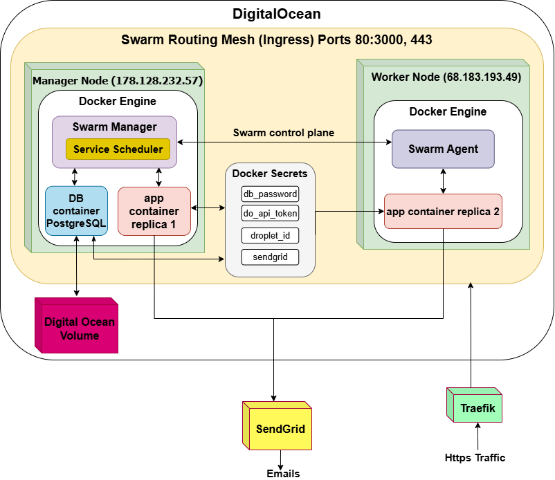

Figure 1 - A depiction of the application deployment. 

Figure 1 shows that the system is deployed using DigitalOcean. The application was built using a React.js frontend and Node.js backend. The application is containerized through Docker, and the image is registered through Docker Hub. The system uses Docker Swarm for orchestration, where a cluster of two nodes is used. The nodes consist of two DigitalOcean droplets: a manager (178.128.232.57) and a worker (68.183.193.49). The manager controls the swarm cluster; it also has an application replica and a PostgreSQL database container running. A DigitalOcean Volume is mounted to the manager node to ensure data persistence even if the database container were to restart. The worker node runs the second application container replica for load balancing. Load balancing is achieved through the Docker Swarm Routing Mesh. Traefik is used to handle HTTPS traffic for all client server interactions. Docker secrets contain the API credentials related to the database, retrieving DigitalOcean metrics, and SendGrid. SendGrid is used as one of the external services to send out emails. Finally, DigitalOcean metrics track system resources and send admin emails if thresholds are reached.

| Feature | Technology | Description |
|----------|-----------|---------|
| **Frontend** | React.js with CSS | User interface |
| **Backend** | Node.js | Created REST endpoints|
| **Database** | PostgreSQL | Relational data storage |
| **Storage** | DigitalOcean Volumes | Persistent database storage |
| **Orchestration** | Docker Swarm | Container orchestration across Manager node: 178.128.232.57 and Worker node: 68.183.194.4 |
| **Cloud provider** | DigitalOcean | Hosts Droplets and Volume |
| **Containerization** | Docker Engine + Docker Hub | Image building and registry |
| **Security** | Docker Secrets, Traefik, Bycrpt | Securing credentials, HTTPS, and Hashing |
| **Monitoring** | DigitalOcean Metrics API | Resource monitoring and threshold alerts |
| **Automated Emails**| SendGrid API | Emails to be sent to Admin, Students, Counsellors, and Supervisors |

## Features:
### User Features:
  - Secure user registration and authentication
    - Users registered using verified email and password (passwords are encrypted before being stored in the database) 
    - All communication occurs over HTTPS for secure communication
    - Admin maintains a list of pre-approved emails, roles and schools to securely control access to the application 
    - Adding a user in the admin panel automatically triggers a SendGrid registration email
    - SendGrid is also implemented for the forget-password emails 
    - Users are stored persistently in the database in a volume mounted on the droplet 
  - Role-based access control 
    - Students, guidance counselors, and admins have different permissions and are restricted in what they can see and interact with 
    - Ensure that each user can only access features relevant to their role 
  - Volunteer hour submission 
    - Students submit volunteer hour forms with date, duration, organization, supervisor info and activity description through the application 
    - Students can edit submissions anytime before the supervisor reviews them 
    - Students can delete submissions anytime 
    - Submissions are stored persistently in the database in a volume mounted on the droplet 
  - Automated supervisor verification
    - Supervisors receive a SendGrid email with a unique link to approve or deny the submission 
    - No account is required for supervisors
  - Guidance counsellors review workflow
    - Counsellors can see all pending submissions (after supervisor approval) 
    - Can flag and accept or reject submissions directly through the dashboard 
    - Students automatically receive an email notification about the final status 
  - Dashboards for increased visibility 
    - Students see a dashboard with their progress towards the 40-hour requirement, summary graphs by status, and their submission with statuses 
    - Counsellors see a dashboard with hours completed by student, pending requests and aggregated school-wide progress metrics

### Features Stemming from Core and Advanced Requirements 
| Feature                                               | Implementation                                                                                                                                                                                                 |
|-------------------------------------------------------|----------------------------------------------------------------------------------------------------------------------------------------------------------------------------------------------------------------|
| Web application is deployed and accessible to users   | The application is deployed via deployment provider, DigitalOcean to ensure reliable and public access to the web application.                                                             |
| Persistent state is maintained across all users and data  | Persistence is achieved using PostgreSQL for structured data storage and DigitalOcean volumes to ensure that database files remain persistent across container restarts and deployments.                 |
| Application supports load balancing and horizontal scaling | Docker Swarm is used to orchestrate multiple service replicas, enabling automatic load balancing, high availability, and the ability to scale horizontally as demand increases.                               |
| System administrators can monitor cloud resource usage | DigitalOcean Alerts notify admins when resource usage crosses predefined thresholds. In addition, a custom system metrics dashboard, powered by the DigitalOcean API, is available at: https://178.128.232.57/system-metrics |
| Application enforces robust security practices        | HTTPS is implemented for secure communication. Role-based access control ensures users only access permitted features. Passwords are hashed before storage, and Docker secrets protect sensitive information, such as API keys.      |
| Application sends automated email notifications        | SendGrid is integrated throughout the platform to automatically send emails for account registration, password reset requests, supervisor approval workflows, and updates to students about submission status.   |


## Video Demo: 
https://youtu.be/YI18Yg-UEIo

## User Guide:
The application is divided into three user roles. These roles are student, guidance counselor, external supervisor, and admin. The following instructions outline the complete workflow from system setup to regular usage. 
### Admin Workflow 
The first required step is to populate the user database, which is performed by an admin. In a deployment scenario, the school contacts the application integration team and provides a list of all students and guidance counselors who require access to the system. The integration team then assigns one or more admins, who are responsible for creating all user accounts and assigning the correct roles. This process ensures only admin users can add accounts or modify privileged information.

Once the admin receives the user lists, they use the Web User Interface to create entries in the *users* database (see figure 2). For each student and guidance counselor, the admin inputs the user’s full name, email address, school ID, and school name, and then assigns the appropriate role. After the admin creates the user accounts, each user receives an automated email generated through SendGrid.
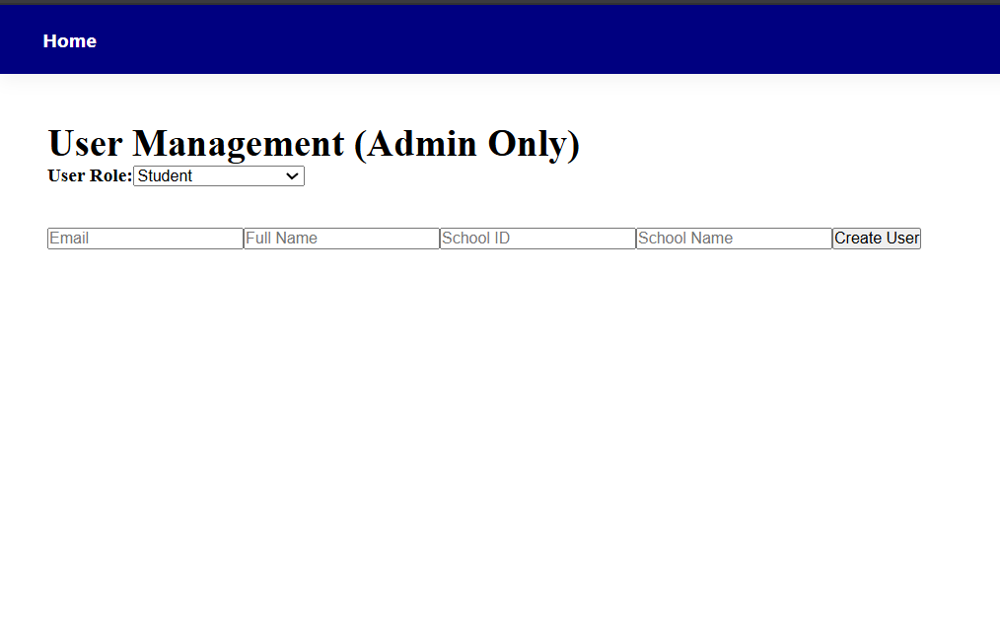

**Figure 2.** Admin User Creation Page.

### User Registration Workflow

 After the admin creates the new user, the email may be sent to the new users junk/spam mail. For a visual refer to Figure 3. To access the link you must press “Looks Safe” as indicated in Figure 3 to enter the link from your inbox. This email provides a link to the registration portal, where the user completes their initial account setup. During registration, the user verifies their email address and then enters their password, full name, and graduation date. The registration interface is shown in Figure 4. After completing the account setup, the system directs each user to a dashboard that corresponds to their assigned role. Students and guidance counselors do not share the same interface and so each role has a distinct dashboard designed for its responsibilities. Additionaly, students or guidance counsellors can use the forget password function on the login page to set a new password - a verification code will be sent to the user's email (may appear in Spam/Junk).

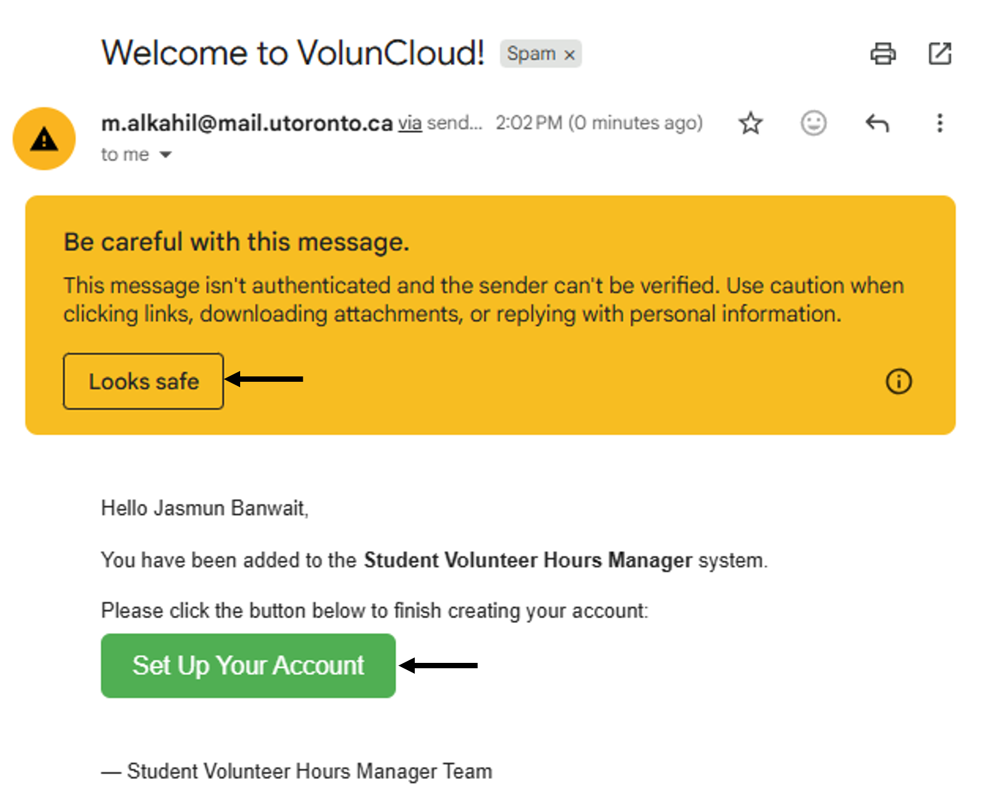

**Figure 3.** Email Notification.

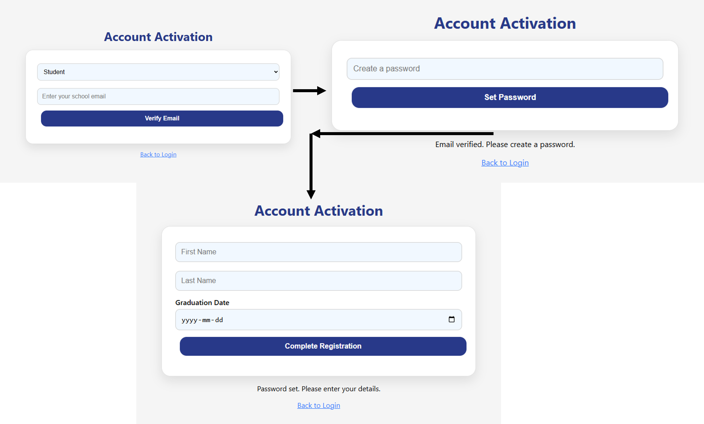

**Figure 4.** Student Registration Page.

### Student Workflow

After registration the user needs to login. To login, the student must head to the login page at https://178.128.232.57/. At this page the students are directed to log in using their registered credentials and are then directed to the main dashboard. The login page can be seen in Figure 5. The dashboard presents three key visual components. On the left, students see a cumulative graph displaying all volunteer hour submissions categorized by status (Approved, Pending–Guidance Counselor, Pending–Supervisor, and Rejected). On the right, submissions are grouped by month and status to provide a chronological breakdown through a bar chart. At the bottom of the dashboard, students can view a detailed editable table listing all of their submissions along with their current review state such as Approved, Rejected, or Pending review by either the external supervisor or the guidance counselor. The full user interface can be visualized in Figure 6.
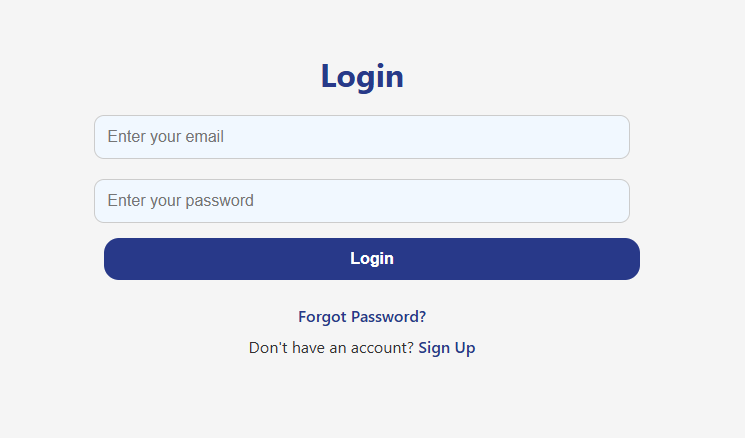

**Figure 5.** Login Page.

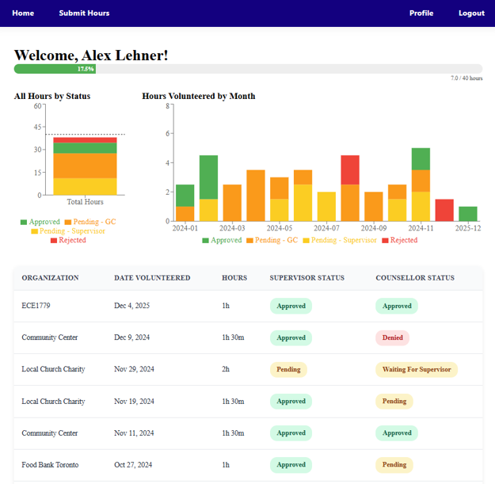

**Figure 6.** Student Dashboard.

The primary function of the student dashboard is to allow students to submit their volunteer hours online instead of using paper forms. To create a new submission, the student selects the Submit Hours option from the top navigation bar. This opens the submission form, where the student enters the required information, including the date of volunteering, organization name, number of hours and minutes, a description of the activity, and the supervisor’s contact details. To see a visual of the Submit Hours user interface refer to Figure 7.  After the form is submitted, an automated email is sent to the specified supervisor requesting a review of the student's submission. The submitted entry also appears immediately on the student’s dashboard for tracking purposes. If the supervisor has not yet approved or rejected the submission, the student is permitted to update the submitted information via the editable table, as shown in Figure 8. At any point students are able to delete submissions.

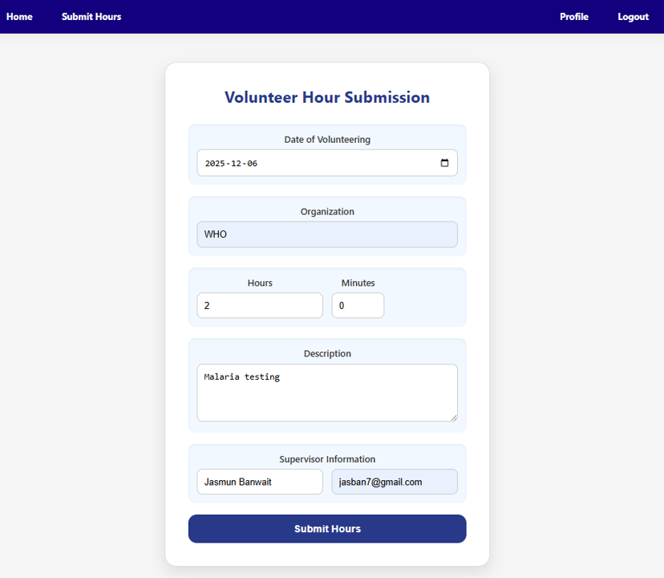

**Figure 7.** Submit Hours Page.

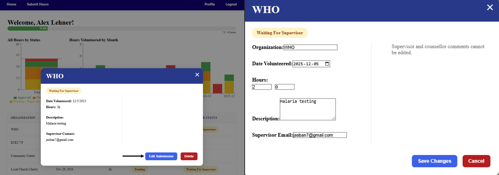

**Figure 8.** Student Review Page.

### Supervisors

After the student submits their volunteer hour submission an automatic email is sent to the supervisor. The received email notification may appear in the spam or junk folder; the supervisor must select “Looks Safe” to move the message to the inbox and enable the review link, as shown in Figure 9. The automated email link leads to a supervisor approval page, this page provides a detailed summary of the student’s submission and allows the supervisor to enter optional comments and either approve or deny the request as seen in Figure 10. If the supervisor approves the submission, the guidance counselor can then review the record through their dashboard, add comments, and finalize the approval. If the supervisor denies the submission, the guidance counselor will not be able to review the submission and the student will see the denial reflected on their dashboard.

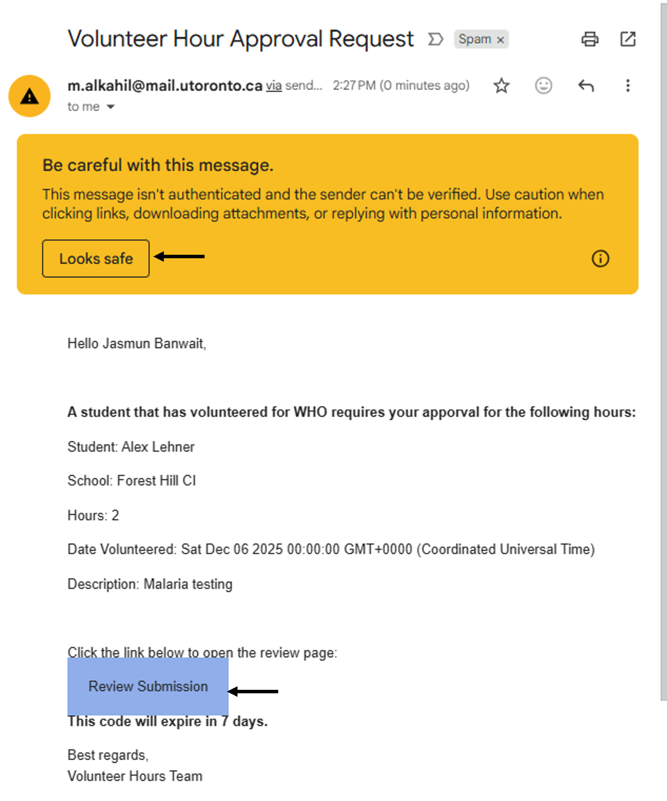

**Figure 9.** Supervisor Email Example.

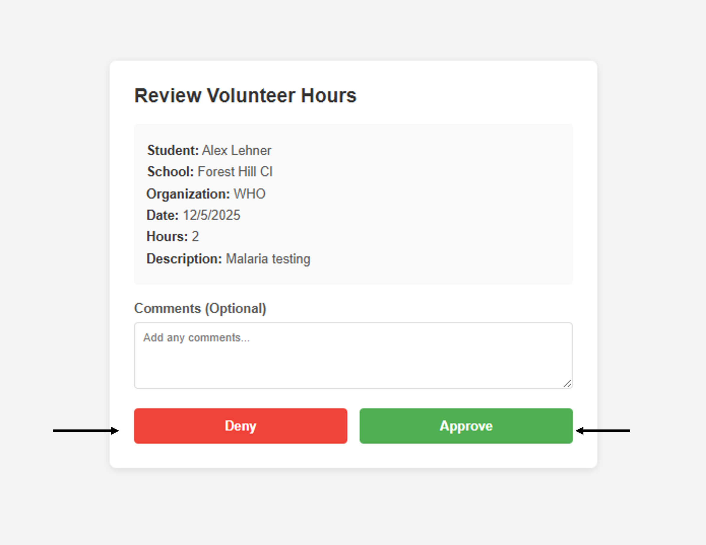

**Figure 10.** Supervisor Review Page.

### Guidance Counselor

The guidance counselor logs into the system using the same registration and authentication process as students. Their dashboard displays all student submissions for students at their school. Once an external supervisor approves a student’s submission, the guidance counselor can view it on their dashboard for final review.
The guidance counselor dashboard contains five main sections. On the left, is the school summary which provides an overview that includes the total number of students, total approved hours, total pending hours, and the number of students who have completed their required 40 hours. On the right, a graphical summary displaying the monthly distribution of submissions that were approved by external supervisors, separated into categories showcasing the submissions that have been approved, are pending, or have been rejected by the guidance counselor. At the bottom of the dashboard, all submissions per student are listed along with their status. Refer to Figure 11 for a visual of this dashboard layout.
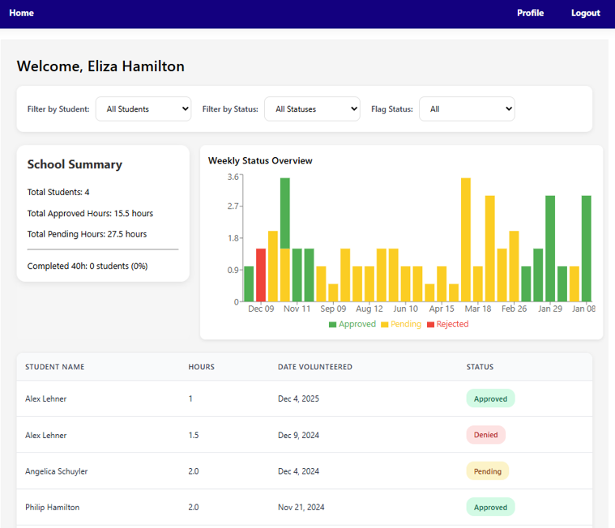

**Figure 11.** Guidance Counselor Dashboard.

Selecting a submission from the bottom panel opens a detailed pop-up window. This window displays student information, supervisor verification details and comments, and the available guidance Counselor actions. The counselor may flag a submission for later review, approve or deny the submission, and add comments. The layout of this submission review interface is shown in Figure 12. The dashboard also includes filtering options that allow the guidance Counselor to sort submissions by student, status, and whether the submission has been flagged. This functionality is illistrated with arrows pointed to the filters in Figure 13.

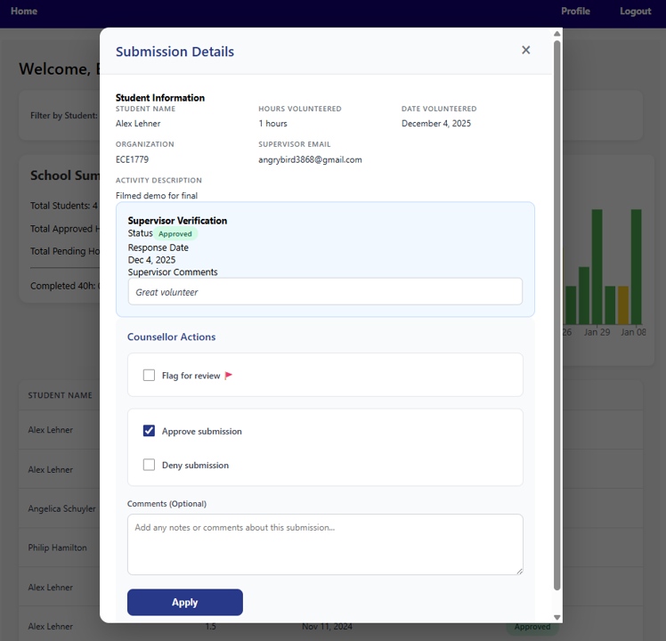

**Figure 12.** Guidance Counselor Review Page.

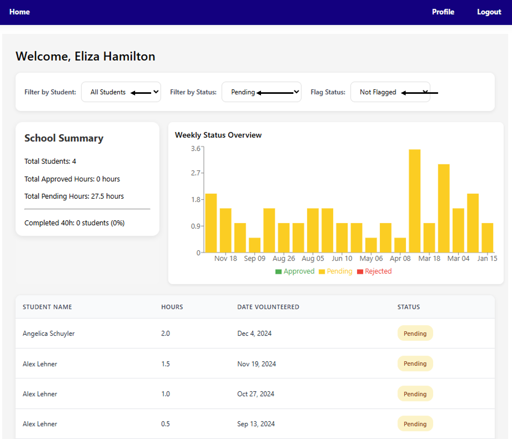

**Figure 13.** Guidance Counselor Filtering Options.

### Profile Management

In addition, both students and guidance counselors have access to a Profile page, which displays their general account information, such as their name, email, school, and graduation date. Users may update this information if changes occur, such as early or delayed graduation. The profile page also displays the guidance counselor assigned to each student. A standard Logout option is provided to allow users to securely exit the system when their session is complete.

### Sample Users (Test Cases)

To assist with evaluation of the system, sample user accounts have been provided for the admin, student, and guidance counselor roles. These accounts allow you to test the complete submission and approval workflow.
 
To experience the student submission process, log in using the sample student account: alexlehner314@gmail.com with the password Password1! at the following URL: https://178.128.232.57/ After logging in, you will see a pre-populated student dashboard where you can create a new volunteer hour submission. For easier visualization during testing, it is recommended that you select a volunteer date one day before the current date, as this will cause the submission to immediately appear at the top of the submission list for both the student and guidance counsellor dashboard.  When entering supervisor information, you can put your own email address which the system will send an email through the SendGrid service, and the message will likely appear in your junk or spam folder. Once received, you may approve or deny the submission using the link provided in the email. If the submission is approved, you may log in as the guidance counselor to continue the review process using the account elizahamilton@test.com with the password Password1!. If the supervisor denies the submission, the denial will be reflected on the student dashboard. Within the guidance counselor dashboard, you may also test the filtering, flagging, and overall review interface designed to help counselors manage student submissions effectively.

To test the workflow from the perspective of setting up a new school, log in using the provided admin account: admin@test.com with the password Password123!. Once logged in, you can create a new school, add student and counselor accounts, and assign them the same school ID and school name. After the users are created, you may proceed to submit volunteer hours as the newly created student and follow the end-to-end approval process for a newly configured school.


Development Guide: 
Set up:
Install and open Docker Desktop
Git
VS Code (Remote SSH extension installed)
DigitalOcean Account (Metrics API key generated)

Note: Credentials have been emailed to the TA by EMAIL OF PERSON


Clone the Repository
```
git clone https://github.com/alexlehner3868/StudentVolunteerHoursManager-CloudProject
```
3. Build and Push Docker Image
Note:
Ensure Docker Desktop is running on local machine
Replace [your_dockerhub_username] with your actual Docker Hub username.
```
# Access the root directory of the project
cd StudentVolunteerHoursManager-CloudProject

#Log in to Docker Hub
docker login

#Build Docker image
docker build -t [your_dockerhub_username]/student-volunteer-app:latest .

#push image to your dockerhub
docker push [your_dockerhub_username]/student-volunteer-app:latest
```
4. Connect to DigitalOcean Manager Node via SSH

4.1 Set Up SSH Connection in VS Code
Press Ctrl+Shift+P
Search for and select: Remote-SSH: Connect to Host
Click Add New SSH Host
Enter the ip address for manager node
Select the SSH config file 

4.2 Connect to the Droplet
Press Ctrl+Shift+P
Select: Remote-SSH: Connect to Host
Choose the manager node IP address
Once connected, click Open Folder from the left bar
Once open, select ‘/root/’ and click ok

5. Set up Deployment Files on Manager Node

5.1 Create Project Directory
Open terminal 
```
#create the folder
mkdir student-volunteer-deploy
cd student-volunteer-deploy
```

5.2 Docker Hub Login
```
#Log in to Docker Hub
docker login
```
5.3 Create Docker Stack Configuration for Docker Swarm
```
Nano docker-stack.yaml
```
Copy the following into docker-stack.yaml
Note: Replace [your_dockerhub_username] with your actual Docker Hub username.
```
version: "3.8"

services:
  app:
    image: [your_dockerhub_username]/student-volunteer-app:final

    environment:
      DB_HOST: db
      DB_PORT: 5432
      DB_NAME: student_volunteer
      DB_USER: admin
      DB_PASSWORD_FILE: /run/secrets/db_password
      DO_API_TOKEN_FILE: /run/secrets/do_api_token
      DROPLET_ID_FILE: /run/secrets/droplet_id
      SENDGRID_API_KEY_FILE: /run/secrets/sendgrid_api_key

    networks:
      - app-network
      - traefik_proxy

    secrets:
      - db_password
      - do_api_token
      - droplet_id
      - sendgrid_api_key

    deploy:
      replicas: 2
      restart_policy:
        condition: on-failure
      labels:
        - "traefik.enable=true"

        # BACKEND API ROUTER
        - "traefik.http.routers.student_api.rule=PathPrefix(`/api`)"
        - "traefik.http.routers.student_api.entrypoints=websecure"
        - "traefik.http.routers.student_api.tls=true"
        - "traefik.http.routers.student_api.service=student_api"
        - "traefik.http.routers.student_api.priority=1000"
        - "traefik.http.services.student_api.loadbalancer.server.port=3000"

        # FRONTEND ROUTER
        - "traefik.http.routers.student_front.rule=PathPrefix(`/`)"
        - "traefik.http.routers.student_front.entrypoints=websecure"
        - "traefik.http.routers.student_front.tls=true"
        - "traefik.http.routers.student_front.service=student_front"
        - "traefik.http.routers.student_front.priority=1"
        - "traefik.http.services.student_front.loadbalancer.server.port=3000"

  db:
    image: postgres:15-alpine
    environment:
      POSTGRES_DB: student_volunteer
      POSTGRES_USER: admin
      POSTGRES_PASSWORD_FILE: /run/secrets/db_password
    secrets:
      - db_password
    volumes:
      - db-data:/var/lib/postgresql/data
      - ./database/init.sql:/docker-entrypoint-initdb.d/init.sql
    networks:
      - app-network
      - cloudflared-network
    deploy:
      placement:
        constraints: [node.role == manager]
      restart_policy:
        condition: on-failure

networks:
  app-network:
    driver: overlay
  cloudflared-network:
    name: cloudflared-network
  traefik_proxy:
    external: true
    name: traefik_traefik_proxy


volumes:
  db-data:
    driver: local
    driver_opts:
      type: none
      o: bind
      device: /mnt/volume_tor1_01/postgres-data

secrets:
  db_password:
    external: true
  do_api_token:
    external: true
  droplet_id:
    external: true
  sendgrid_api_key:
    external: true
```

5.4 Set Up Secrets Files
```
#Create secrets folder
mkdir secrets

#Create secret files and add credentials that were sent to TA by email
nano secrets/db_password.txt
nano secrets/do_api_token.txt
nano secrets/droplet_id.txt
nano secrets/sendgrid_api_key.txt
```

5.5 Set Up Database
```
#Create database folder
mkdir database

#Create init.sql file
nano database/init.sql
```

Copy the following into init.sql
```
-- =========================================
-- USERS TABLE
-- =========================================
CREATE TABLE IF NOT EXISTS Users (
    UserID SERIAL PRIMARY KEY,
    Type VARCHAR(50) NOT NULL,
    Email VARCHAR(100) NOT NULL UNIQUE,
    PasswordHash VARCHAR(255) NOT NULL,
    VerificationCode VARCHAR(6),
    VerificationExpiryTime TIMESTAMP
);

-- =========================================
-- STUDENT TABLE
-- =========================================
CREATE TABLE IF NOT EXISTS Student (
    UserID INT PRIMARY KEY REFERENCES Users(UserID),
    StudentName VARCHAR(100),
    SchoolID VARCHAR(50),
    SchoolName VARCHAR(100),
    GraduationDate DATE
);

-- =========================================
-- GUIDANCE COUNSELLOR TABLE
-- =========================================
CREATE TABLE IF NOT EXISTS GuidanceCounsellor (
    UserID INT PRIMARY KEY REFERENCES Users(UserID),
    CounsellorName VARCHAR(100),
    SchoolID VARCHAR(50),
    SchoolName VARCHAR(100)
);

-- =========================================
-- VOLUNTEER HOUR SUBMISSION TABLE
-- =========================================
CREATE TABLE IF NOT EXISTS VolunteerHourSubmission (
    SubmissionID SERIAL PRIMARY KEY,
    StudentID INT REFERENCES Student(UserID) ON DELETE CASCADE,
    Hours DECIMAL(5,2),
    DateVolunteered DATE,
    Description TEXT,
    Organization TEXT,
    ExternSupEmail VARCHAR(100),
    ExternSupStatus VARCHAR(20),
    ExternSupDate DATE,
    ExternSupComments TEXT,
    supervisor_token VARCHAR(64) UNIQUE,
    supervisor_token_expiry TIMESTAMP,
    GuidanceCounsellorFlag BOOLEAN,
    GuidanceCounsellorApproved VARCHAR(20),
    GuidanceCounsellorComments TEXT,
    GuidanceCounsellorID INT REFERENCES GuidanceCounsellor(UserID) ON DELETE SET NULL,
    VerdictDate DATE
);

-- =========================================
-- DEFAULT ADMIN USER (only if missing)
-- =========================================
INSERT INTO Users (Type, Email, PasswordHash)
SELECT 'Admin', 'admin@test.com',
       '$2a$10$e0MYzXyjpJS7Pd0RVvHwHeFX5H2b8qZt1c6NVoyk4I5hPDe3T1H0W'  -- bcrypt("Password123!")
WHERE NOT EXISTS (
    SELECT 1 FROM Users WHERE Email = 'admin@test.com'
);

```


6. Create Docker secrets
```
cat secrets/db_password.txt | docker secret create db_password -
cat secrets/do_api_token.txt | docker secret create do_api_token -
cat secrets/droplet_id.txt | docker secret create droplet_id -
cat secrets/sendgrid_api_key.txt | docker secret create sendgrid_api_key -

#Verify secrets were created
docker secret ls
```

7. Verify DigitalOcean Volume setup
```
# Check if volume is mounted
df -h | grep volume
```
If the volume is not mounted, go to the DigitalOcean dashboard and mount a volume.	

8. Set up Traefik Stack Configuration
8.1 Traefik Stack file
```
Nano traefik-stack.yml
```

Copy the following into traefik-stack.yml
```
version: "3.8"

services:
  traefik:
    image: traefik:v3.4

    networks:
      - traefik_proxy

    ports:
      - target: 80
        published: 80
        protocol: tcp
        mode: host
      - target: 443
        published: 443
        protocol: tcp
        mode: host

    volumes:
      - /var/run/docker.sock:/var/run/docker.sock:ro
      - ./certs:/certs:ro
      - ./dynamic:/dynamic:ro

    command:
      - "--entrypoints.web.address=:80"
      - "--entrypoints.web.http.redirections.entrypoint.to=websecure"
      - "--entrypoints.web.http.redirections.entrypoint.scheme=https"
      - "--entrypoints.web.http.redirections.entrypoint.permanent=true"

      - "--entrypoints.websecure.address=:443"
      - "--entrypoints.websecure.http.tls=true"

      - "--providers.file.filename=/dynamic/tls.yaml"
      - "--providers.swarm.endpoint=unix:///var/run/docker.sock"
      - "--providers.swarm.watch=true"
      - "--providers.swarm.exposedbydefault=false"
      - "--providers.swarm.network=traefik_traefik_proxy"

      - "--api.dashboard=true"
      - "--api.insecure=false"
      - "--log.level=INFO"
      - "--accesslog=true"
      - "--metrics.prometheus=true"

    deploy:
      mode: replicated
      replicas: 1
      placement:
        constraints:
          - node.role == manager
      labels:
        - "traefik.enable=true"
        - "traefik.http.services.traefik.loadbalancer.server.port=8080"
        - "traefik.http.routers.dashboard.rule=Host(`dashboard.swarm.localhost`)"
        - "traefik.http.routers.dashboard.entrypoints=websecure"
        - "traefik.http.routers.dashboard.service=api@internal"
        - "traefik.http.routers.dashboard.tls=true"

networks:
  traefik_proxy:
    external: true
    name: traefik_traefik_proxy
```

8.2 Deploy Traefik
```
docker stack deploy -c traefik-stack.yaml traefik

# Verify Traefik is running
docker service ls | grep traefik

# Check Traefik logs
docker service logs traefik_traefik -f
```

9. Initialize Docker Swarm on Manager Node
Note: Copy the resulting command after running swarm init, it shold look like docker swarm join --token
```
docker swarm init --advertise-addr [manager_ip_address]
```

10. Deploy application stack

```
docker stack deploy -c docker-stack.yaml studentvolunteer
```

Verify the deployment
```
# List all services
docker stack services studentvolunteer

# Check service logs
docker service logs studentvolunteer_app -f

# View running containers
docker ps
```

11. Join Worker Node to Swarm
11.1 SSH into Worker Node
Open new VS Code window and repeat step 3 but for your worker droplet

11.2 Join the swarm
In the worker terminal run the docker swarm join command you got from the manager
```
docker swarm join --token 
```

Verify the deployment
```
# List all services
docker stack services studentvolunteer

# Check service logs
docker service logs studentvolunteer_app -f

# View running containers
docker ps
```


11.3 Verify Worker Node Joined
On the manager node verify the nodes in the system
```
docker node ls
```


12. Access the Application
Open a web browser and head to the web address
Note: Replace [manager_ip-address] with the actual manager node ip address
```
http://[manager_ip-address]
```
fro
Remember for swarm, we had to add secrets to env 
We should also push our scripts to get the image to the website and then how to get it onto swarm 
Email API keys (HTTPS credentials) and database credentials and anything else protected to TA quincy.zhang@mail.utoronto.ca and state “Credentials sent to TA” in the development guide 

Lessons Learned and Concluding Thoughts:
We all really enjoyed ECE1779 and learning about cloud technologies. In addition to deepening our knowledge of the cloud, through this project we also learned valuable lessons about working in a team to ship a real-world product - skills that will benefit us professionally going forward.

A key lesson we learned was the importance of keeping the project objective front of mind and iteratively revisiting and validating key system components. We designed our database schema early in the project and didn’t review it as the system requirements evolved. As a result, the schema became misaligned with the functionality of the application, which led to rework, complex patches, and a database schema not fully optimized for the final system. In hindsight, we realized that staying too focused on the implementation details caused us to disregard broader objectives and that devoting time on a regular cadence to ensure that our roadmap for the project is still aligned to the overall objective would have saved several downstream issues before they became laborious to correct. 

We also gained insight into working collaboratively under real operational constraints. While Git enabled our team to work in parallel, deployment and testing presented challenges because our droplet could only support one active testing user at a time since only one image could be running on the droplet at any given time. This bottleneck forced us to communicate frequently and plan our testing sessions in advance. This experience both developed our logistical planning and communication skills while underscoring the importance of infrastructure planning, as having multiple droplets set up for testing purposes would have improved our workflows. We learned that parallel development requires a great deal of logistical planning. 

Another takeaway was the level of grit and creative problem-solving required to tackle technical obstacles. There were moments when we were collectively stumped, such as when deploying our application directly on the droplet repeatedly crashed multiple machines due to CPU and memory overload. After extensive confusion, we eventually ascertained the solution to be building the image locally and transferring the image, rather than the full codebase, to the droplet. Another major hurdle came from transferring our application from Docker Compose, where it ran smoothly, to Docker Swarm. Configuring a working Docker Swarm stack file pushed us beyond the scope of our classroom learnings. We approached these challenges with curiosity, collaboration and persistence, spending many hours reading documentation, iterating solutions and experimenting together. These experiences highlighted the importance  of resilience, teamwork and creative thinking when learning and trying novel pursuits. 

In conclusion, we had a great time this semester and have thoroughly enjoyed the opportunity to apply course concepts to solve a real-world problem. This project strengthened our understanding of cloud infrastructure, web development, and parallel teamwork. We are excited to continue learning more about cloud technology and continuing to create innovative solutions driving real-world impact. 


Individual Contributions: 
Alex:
Core feature setup (DO droplets, docker swarm, volumes, etc)
Student volunteer hour submissions functionality 
Student dashboard graphs, stats, visualizations filtering and list of previous submissions
Students can edit and delete prior submissions 
Counsellor dashboard (Graphs, filtering, flag submissions) 
Profile page that vary by user type and allow editing, where applicable 
Logout functionality 
Admin page to add users to backend system and trigger SendGrid for registration 
SendGrid for user registration 
Webpage navigation, which is variable by user
Implemented role based user authentication 
Mohamad:
Core feature setup (DO droplets, docker swarm, volumes, etc)
User Login
Password reset
Counsellor Dashboard (viewing associated submissions, filtering submissions, displaying selected submission, approve and deny submissions)
Pop-up message component
Supervisor approve and deny submissions
SendGrid for student submission 
SendGrid for supervisors to approve and deny submissions
SendGrid for counsellor decision
Jasmun:
Core feature setup (DO droplets, docker swarm, volumes, etc)
DigitalOcean monitoring and alerts
HTTPS
Student Register page
Guidance counsellor register page
User validation API
Round Robin meshing


